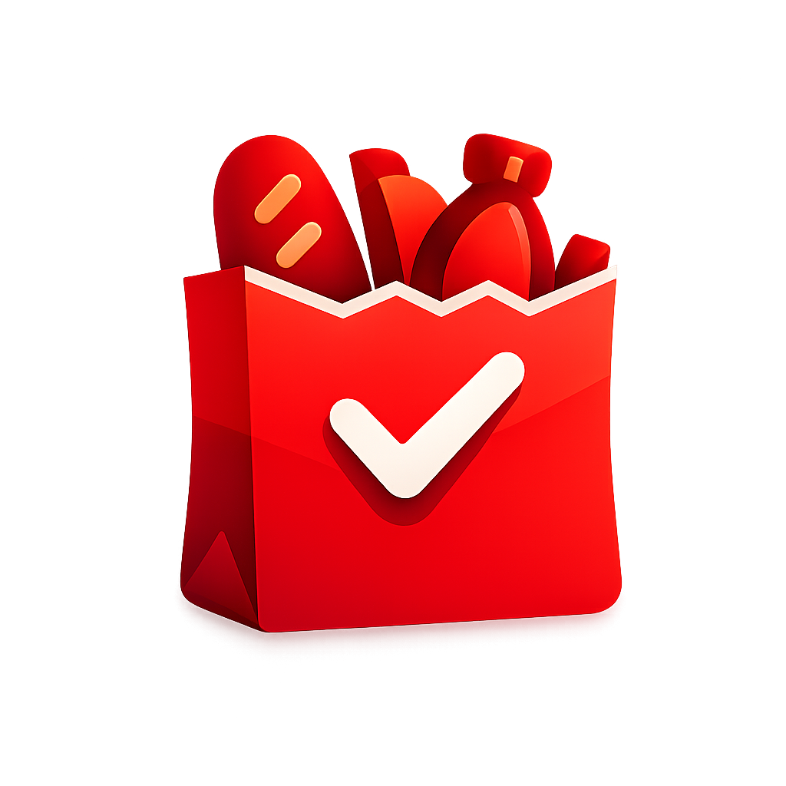

<div align="center">



# Foodly

**Tu asistente inteligente para gestionar alimentos en casa.**  
Sin desperdicio, sin olvidos.

[](https://github.com/Deibyd07/PantryScanner/releases/tag/v1.0.0)

---

[](https://flutter.dev)
[](https://dart.dev)
[](https://firebase.google.com)
[](https://github.com/Deibyd07/PantryScanner/actions/workflows/flutter_ci.yml)
[](https://github.com/Deibyd07/PantryScanner/actions)
[](LICENSE)

</div>

---

## Índice

- [¿Qué es Foodly?](#qué-es-foodly)
- [Funcionalidades](#funcionalidades)
- [Stack técnico](#stack-técnico)
- [Arquitectura](#arquitectura)
- [Sistema de diseño](#sistema-de-diseño)
- [Estructura del proyecto](#estructura-del-proyecto)
- [Instalación y configuración](#instalación-y-configuración)
- [Tests](#tests)
- [CI / CD](#ci--cd)
- [Descarga](#descarga)
- [Versioning](#versioning)

---

## ¿Qué es Foodly?

Foodly es una aplicación móvil **offline-first** para Android que resuelve un problema cotidiano: no saber qué hay en casa, comprar duplicado o descubrir productos vencidos demasiado tarde.

Con Foodly puedes:
- Escanear productos con la cámara y registrarlos en segundos
- Ver el estado de cada producto: normal, vence pronto, vencido o agotado
- Recibir notificaciones push antes de que algo caduque o se acabe
- Descubrir recetas que puedes preparar con lo que ya tienes
- Generar listas de compras con lenguaje natural ("2 leches", "3 kg harina")
- Acceder a todo sin conexión y sincronizar cuando vuelves a tener internet

---

## Funcionalidades

### Autenticación
- Registro e inicio de sesión con email y contraseña
- Inicio de sesión con Google (OAuth)
- Recuperación de contraseña por correo
- Edición de nombre, cambio de contraseña y eliminación de cuenta
- Aislamiento total de datos por usuario (cada cuenta ve solo su inventario)

### Inventario
- Lista reactiva con estados visuales por producto
- Filtros por categoría con contadores en tiempo real
- Búsqueda en tiempo real con debounce de 300 ms
- Ordenamiento persistido: nombre, cantidad, caducidad o categoría
- Ajuste rápido de cantidad con botones +/−
- Swipe para eliminar con confirmación y opción de deshacer
- Pantalla de detalle con historial y acciones rápidas
- Stock mínimo configurable por producto

### Escáner
- Escaneo EAN-13 y UPC-A con validación de checksum
- Búsqueda automática en OpenFoodFacts con caché offline
- Linterna integrada para condiciones de poca luz
- Fallback a registro manual si no se encuentra el producto

### Alertas inteligentes
- Notificaciones push de caducidad (configurables por días)
- Alertas de stock mínimo agrupadas por categoría
- Programación diaria en background con timezone correcto
- Inbox de notificaciones recibidas dentro de la app

### Recetas
- Catálogo de 23 recetas con imágenes empaquetadas
- Algoritmo de coincidencia por ingredientes disponibles en despensa
- Score ponderado: cobertura + boost para ingredientes que vencen pronto
- Soporte de ingredientes opcionales y normalización de diacríticos
- Ordenamiento: disponibles primero → mayor score → menor tiempo

### Lista de compras
- Parser de lenguaje natural para entrada rápida
- Soporte de cantidades y unidades ("2 leches", "500g harina")
- Edición in-line con confirmación de compra
- Deshacer eliminación
- Sincronización bidireccional con Firestore

### Perfil
- Datos del usuario con estadísticas de uso
- Cambio de idioma (español / inglés) persistido
- Gestión de cuenta: editar nombre, cambiar contraseña, eliminar cuenta

### Onboarding
- Tutorial de 3 slides en el primer arranque
- Logo real + texto animado (el logo permanece fijo al deslizar)
- Botón "Saltar" y "Comenzar" con persistencia en SharedPreferences
- No vuelve a mostrarse en aperturas siguientes

### Sincronización
- SQLite como fuente de verdad (offline-first)
- Sincronización bidireccional con Cloud Firestore
- Indicador visual del estado de sincronización
- Resolución de conflictos por timestamp

---

## Stack técnico

| Categoría | Tecnología | Versión |
|-----------|-----------|---------|
| **Framework** | Flutter | 3.41.5 |
| **Lenguaje** | Dart | ≥ 3.3.0 |
| **Estado** | flutter_riverpod | 2.5.1 |
| **Navegación** | go_router | 14.2.0 |
| **Base de datos local** | sqflite | 2.4.2 |
| **Nube — Auth** | firebase_auth | 5.4.1 |
| **Nube — DB** | cloud_firestore | 5.6.12 |
| **Analítica** | firebase_analytics | 11.3.3 |
| **Crash reporting** | firebase_crashlytics | 4.3.1 |
| **Login social** | google_sign_in | 6.2.2 |
| **HTTP** | dio | 5.7.0 |
| **Conectividad** | connectivity_plus | 6.1.4 |
| **Escáner** | mobile_scanner | 5.2.3 |
| **Notificaciones** | flutter_local_notifications | 17.2.2 |
| **Imágenes** | image_picker · cached_network_image | 1.2.2 · 3.4.1 |
| **Tipografías** | google_fonts (Plus Jakarta Sans + Epilogue) | 6.2.1 |
| **Preferencias** | shared_preferences | 2.3.2 |
| **i18n** | flutter_localizations + intl | 0.20.0 |
| **IDs únicos** | uuid | 4.5.3 |

---

## Arquitectura

Foodly sigue **Clean Architecture por feature**. Cada módulo es autónomo y tiene sus propias capas:

```
feature/
├── domain/          ← reglas de negocio puras (entidades, contratos, casos de uso)
├── data/            ← implementaciones concretas (SQLite, Firestore, APIs)
└── presentation/    ← UI, widgets, providers Riverpod
```

**Flujo de datos:**

```
UI (Riverpod Provider)
    ↕  watch / read
Domain (Use Case)
    ↕  interface
Data (Repository impl.)
    ↕
SQLite ←──sync──→ Firestore
```

**Principios clave:**
- **Offline-first**: SQLite es la fuente de verdad; Firestore es la capa de sincronización
- **Inversión de dependencias**: `domain` no importa nada de `data` ni de Flutter
- **Reactividad**: streams de SQLite hacia la UI vía Riverpod sin polling
- **Aislamiento por usuario**: columna `user_id` en todas las tablas locales; `setCurrentUser()` en repositorios al login

**19 casos de uso distribuidos en 10 features:**

| Feature | Casos de uso |
|---------|-------------|
| auth | `LoginWithEmail`, `RegisterWithEmail`, `LoginWithGoogle`, `ResetPassword`, `UpdateDisplayName`, `UpdatePassword`, `DeleteAccount`, `Logout`, `WatchAuthState` |
| inventory | `WatchInventoryItems`, `SaveInventoryItem`, `DeleteInventoryItem`, `UpdateInventoryItemQuantity`, `SortInventoryItems` |
| scanner | `ScanBarcode` |
| recipes | `FindMatchingRecipes` |
| notifications | `GetNotificationSettings`, `SaveNotificationSettings`, `WatchNotificationSettings` |
| shopping list | `QuickAddParser` |

---

## Sistema de diseño

Foodly tiene un sistema de diseño propio en `lib/core/design/` con tokens, componentes y temas diseñados a mano:

| Token / Componente | Descripción |
|-------------------|-------------|
| `AppColors` | Paleta completa light + dark, gradientes de marca, colores semánticos |
| `AppTypography` | Escala tipográfica: Epilogue (display) + Plus Jakarta Sans (body/labels) |
| `AppSpacing` | Escala 4pt — de 2px a 64px |
| `AppRadius` | Border radius tokenizado — de 4px a pill (999px) |
| `AppElevation` | Sombras semánticas: card, modal, FAB, heroIcon |
| `AppDuration` | Duraciones de animación — de 100ms a 1400ms |
| `AppHaptics` | Feedback háptico semántico: tap, confirm, warning, error, success |
| `SplitHeroScaffold` | Patrón visual principal: gradiente arriba + card blanca redondeada abajo |
| `BrandGradientButton` | Botón primario con shimmer animado, estado loading y halo de marca |
| `context.palette` | Acceso al palette adaptado a light/dark vía extension de BuildContext |

---

## Estructura del proyecto

<details>
<summary>Ver estructura completa</summary>

```
PantryScanner/
├── lib/
│   ├── app/
│   │   └── router/
│   │       ├── app_router.dart          # GoRouter con guards de auth y onboarding
│   │       └── router_key.dart
│   ├── core/
│   │   ├── analytics/                   # Firebase Analytics wrapper
│   │   ├── cloudinary/                  # Subida de imágenes a CDN
│   │   ├── constants/                   # Constantes globales de la app
│   │   ├── db/                          # AppDatabase (sqflite) — tablas y migraciones
│   │   ├── design/
│   │   │   ├── platform/                # Hápticos, adaptadores iOS/Android
│   │   │   ├── theme/                   # AppThemeLight, AppThemeDark
│   │   │   ├── tokens/                  # Colors, Typography, Spacing, Radius, Elevation, Duration
│   │   │   └── widgets/                 # BrandGradientButton, SplitHeroScaffold
│   │   ├── i18n/                        # Helpers de localización por dominio
│   │   ├── network/                     # Provider de conectividad
│   │   ├── presentation/widgets/        # OfflineBanner, CheckeredPattern, AppBackground
│   │   └── sync/                        # SyncStatusProvider, InventorySyncService, ShoppingListSyncService
│   ├── features/
│   │   ├── auth/                        # Login, registro, recuperar contraseña
│   │   ├── inventory/                   # Lista, detalle, filtros, ordenamiento
│   │   ├── notifications/               # Alertas de caducidad y stock, inbox
│   │   ├── onboarding/                  # Tutorial de primera vez (3 slides)
│   │   ├── product_form/                # Alta y edición de productos
│   │   ├── profile/                     # Perfil, estadísticas, configuración de cuenta
│   │   ├── recipes/                     # Catálogo y sugerencias por despensa
│   │   ├── scanner/                     # Escáner de código de barras
│   │   ├── settings/                    # Idioma y preferencias persistidas
│   │   └── shopping_list/               # Lista de compras con parser NLP
│   ├── l10n/                            # Archivos ARB (ES + EN) y localizations generadas
│   └── main.dart                        # Bootstrap: Firebase, SharedPreferences, notificaciones
├── test/
│   ├── widget_test.dart                 # AuthLogoHeader — renderiza "Foodly"
│   └── features/
│       ├── inventory/
│       │   ├── inventory_item_test.dart          # 17 tests — status, isLowStock, copyWith
│       │   └── sort_inventory_items_usecase_test.dart  # 12 tests — todos los criterios
│       ├── recipes/
│       │   └── find_matching_recipes_usecase_test.dart # 18 tests — score, boost, sort
│       ├── scanner/
│       │   └── scan_barcode_usecase_test.dart    # 8 tests — EAN-13, UPC-A, edge cases
│       └── shopping_list/
│           ├── quick_add_parser_test.dart         # 13 tests — parser de lenguaje natural
│           └── shopping_list_item_test.dart       # 8 tests — entidad y lógica
├── assets/
│   ├── branding/                        # icon_full, icon_symbol, variantes mono
│   └── images/                          # food_doodle_bg, imágenes de recetas
├── android/                             # Configuración Android (Kotlin DSL)
├── ios/                                 # Configuración iOS
└── .github/
    └── workflows/
        └── flutter_ci.yml               # Pipeline CI: analyze + test + coverage
```

</details>

---

## Instalación y configuración

### Requisitos

| Herramienta | Versión mínima |
|-------------|----------------|
| Flutter SDK | 3.41.x (stable) |
| Dart | ≥ 3.3.0 |
| Android SDK | API 21+ |
| Xcode | 15+ (solo iOS) |

```bash
flutter doctor -v
```

### 1. Clonar el repositorio

```bash
git clone https://github.com/Deibyd07/PantryScanner.git
cd PantryScanner
```

### 2. Configurar Firebase

Este proyecto requiere Firebase. Los archivos de configuración **no están incluidos** en el repositorio:

- `android/app/google-services.json` — descarga desde Firebase Console
- `ios/Runner/GoogleService-Info.plist` — descarga desde Firebase Console

Si no tienes un proyecto Firebase, crea uno en [console.firebase.google.com](https://console.firebase.google.com) y habilita:
- Authentication (Email/Password + Google)
- Cloud Firestore
- Crashlytics
- Analytics

### 3. Instalar dependencias

```bash
flutter pub get
```

### 4. Ejecutar

```bash
# Android
flutter run

# iOS
flutter run -d ios

# Dispositivo específico
flutter run -d <device-id>
```

---

## Tests

El proyecto tiene **77 tests automatizados** cubriendo casos de uso críticos, entidades del dominio y widgets:

```bash
# Ejecutar todos los tests
flutter test

# Con reporte detallado por test
flutter test --reporter=expanded

# Con cobertura de código
flutter test --coverage
```

| Archivo | Tests | Qué cubre |
|---------|-------|-----------|
| `inventory_item_test.dart` | 17 | `status` (6 estados), `isLowStock`, `copyWith` |
| `sort_inventory_items_usecase_test.dart` | 12 | Ordenamiento por nombre, cantidad, caducidad, categoría |
| `find_matching_recipes_usecase_test.dart` | 18 | Matching, score, boost de caducidad, opcionales, sort, diacríticos |
| `scan_barcode_usecase_test.dart` | 8 | Validación EAN-13, UPC-A, edge cases |
| `quick_add_parser_test.dart` | 13 | Parser de lenguaje natural para lista de compras |
| `shopping_list_item_test.dart` | 8 | Entidad y lógica de items de lista |
| `widget_test.dart` | 1 | `AuthLogoHeader` renderiza el nombre de la app |
| **Total** | **77** | |

---

## CI / CD

Cada push a `main`, `testing` o `develop` ejecuta el pipeline automáticamente:

```yaml
# .github/workflows/flutter_ci.yml
jobs:
  unit_tests:
    runs-on: ubuntu-latest
    steps:
      - Checkout código
      - Setup Flutter 3.41.5 (stable, con caché)
      - flutter pub get
      - flutter analyze --no-fatal-infos   # informacional
      - flutter test --reporter=expanded   # 77 tests
      - flutter test --coverage
      - Upload coverage → Codecov
```

Para distribución a testers se usa **Firebase App Distribution**:

```bash
firebase appdistribution:distribute build/app/outputs/flutter-apk/app-release.apk \
  --app <FIREBASE_APP_ID> \
  --release-notes "descripción del build"
```

---

## Descarga

La versión pública más reciente está disponible en GitHub Releases:

### [⬇ Foodly v1.0.0 — Descargar APK](https://github.com/Deibyd07/PantryScanner/releases/tag/v1.0.0)

**Requisitos para instalar:**
1. Android 5.0 (API 21) o superior
2. Activar **Ajustes → Seguridad → Instalar apps desconocidas**
3. Descargar y abrir `Foodly.apk`

---

## Versioning

| Versión | Rama | Descripción |
|---------|------|-------------|
| `v1.0.0` | `testing` | Primera versión pública — onboarding, inventario completo, recetas, lista de compras, sync Firestore |

---

## Licencia

Proyecto privado — todos los derechos reservados © 2026 Deibyd Alcaciega.
