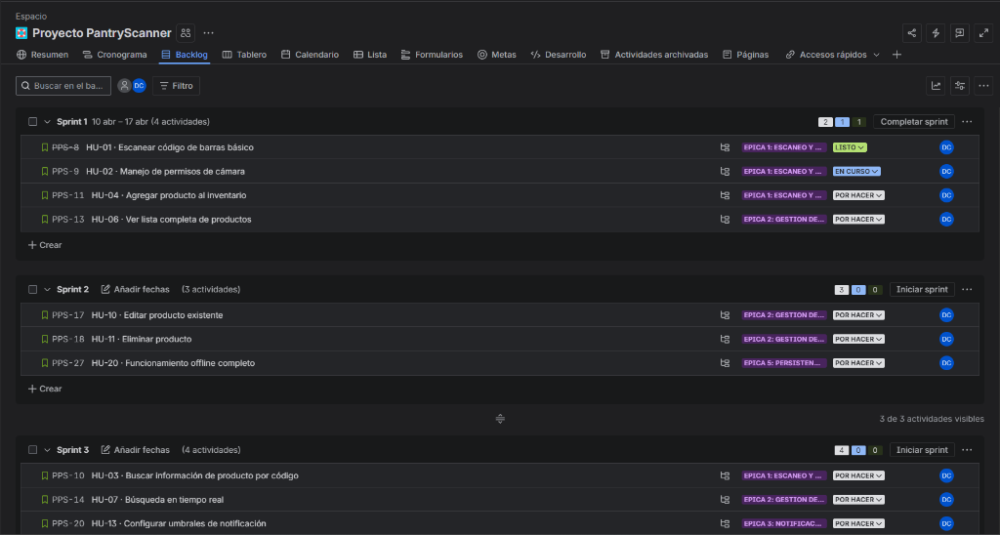
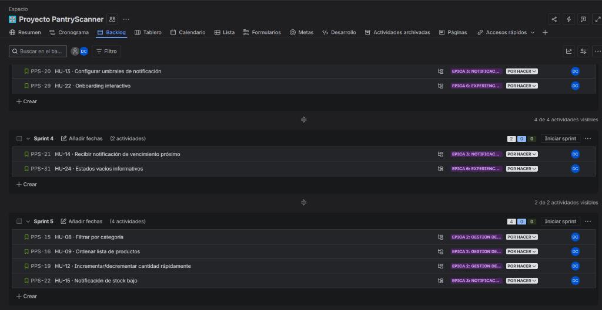
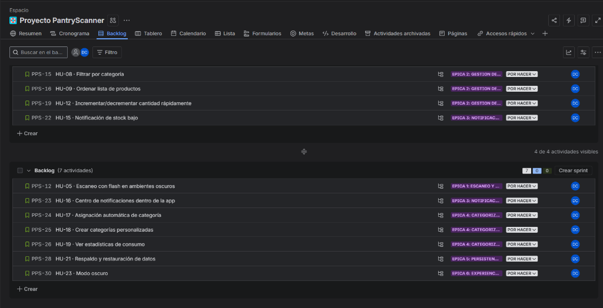
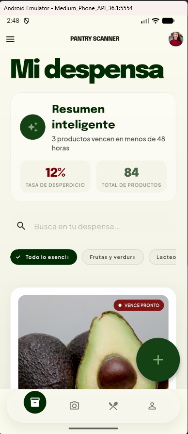
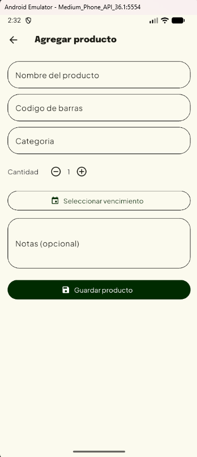
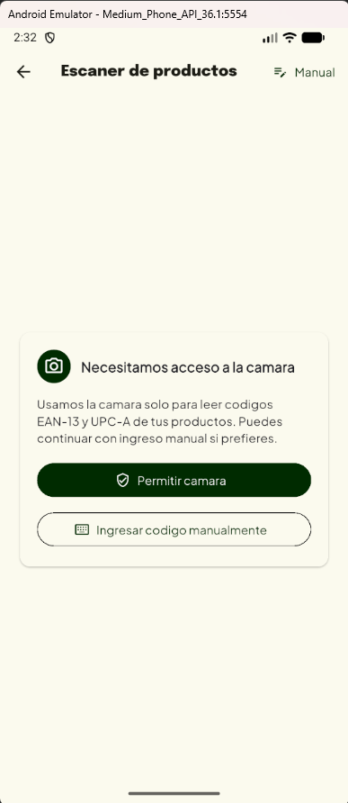

# PantryScanner — Primer Adelanto de Proyecto

> **Equipo de Desarrollo**  
> **Fecha de entrega:** 11 de abril de 2026  
> **Asignatura / Campus:** _[Desarrollo de aplicaciones moviles]_

---

## Tabla de Contenido

1. [Descripción del Proyecto](#1-descripción-del-proyecto)
2. [Repositorio GitHub](#2-repositorio-github)
3. [Gestión del Proyecto en Jira](#3-gestión-del-proyecto-en-jira)
4. [Historias de Usuario](#4-historias-de-usuario)
5. [Sub-actividades por Historia de Usuario](#5-sub-actividades-por-historia-de-usuario)
6. [Primer Bosquejo de la App](#6-primer-bosquejo-de-la-app)

---

## 1. Descripción del Proyecto

**PantryScanner** es una aplicación móvil desarrollada en **Flutter** que permite a los usuarios gestionar el inventario de su despensa mediante el escaneo de códigos de barras. La app resuelve un problema cotidiano: no saber qué hay en casa, comprar productos duplicados o descubrir productos vencidos demasiado tarde.

### Objetivos principales

- **Escaneo rápido:** Agregar productos al inventario escaneando el código de barras con la cámara del dispositivo.
- **Inventario local:** Mantener un registro organizado de todos los productos en la despensa con persistencia offline.
- **Alertas inteligentes:** Notificar al usuario sobre productos próximos a vencer o con stock bajo.
- **Experiencia simple:** Ofrecer una interfaz visual, intuitiva y confiable.

### Stack Tecnológico

| Tecnología | Uso |
|---|---|
| **Flutter + Dart** | Framework principal de desarrollo multiplataforma |
| **Riverpod** | Gestión de estado reactiva |
| **GoRouter** | Navegación y ruteo |
| **Drift + SQLite** | Persistencia local offline-first |
| **Dio** | Cliente HTTP para APIs externas |
| **ML Kit / mobile_scanner** | Escaneo de códigos de barras (EAN-13, UPC-A) |
| **flutter_local_notifications** | Notificaciones locales de vencimiento |

### Arquitectura

El proyecto sigue un enfoque de **Clean Architecture por feature**:

```
lib/
├── app/                    # Configuración de la aplicación
├── core/                   # Elementos compartidos
│   ├── constants/          # Constantes globales
│   ├── database/           # Configuración de Drift/SQLite
│   └── theme/              # Tema y diseño visual
└── features/               # Funcionalidades por módulo
    ├── inventory/          # Listado y gestión de inventario
    ├── product_form/       # Formulario de alta/edición de producto
    └── scanner/            # Escáner de códigos de barras
```

**Patrones aplicados:**
- Source of truth local (offline-first)
- Inversión de dependencias (domain no depende de data)
- Flujo reactivo con streams hacia la UI

---

## 2. Repositorio GitHub

### URL del Repositorio

🔗 **https://github.com/Deibyd07/PantryScanner.git**

### Estrategia de Ramas

El repositorio está configurado con la siguiente estructura de ramas, siguiendo las buenas prácticas de Git Flow:

| Rama | Propósito | Estado |
|---|---|---|
| **`main`** | Rama de producción. Contiene el código estable y listo para release. | ✅ Activa |
| **`develop`** | Rama de desarrollo (equivalente a QA). Aquí se integran todas las features antes de pasar a staging. | ✅ Activa (rama de trabajo actual) |
| **`staging`** | Rama de pruebas. Se usa para validar funcionalidades integradas antes de merge a main. | ✅ Activa |

### Flujo de Trabajo con Ramas

```
feature/hu-xx  →  develop (QA/Desarrollo)  →  staging (Pruebas)  →  main (Producción)
```

1. **Desarrollo:** Se crea una rama `feature/hu-xx-nombre` por cada Historia de Usuario a partir de `develop`.
2. **Integración:** Al completar la feature, se hace Pull Request hacia `develop` para revisión de código.
3. **Pruebas:** Una vez validadas en `develop`, las funcionalidades se promueven a `staging` para pruebas de integración.
4. **Producción:** Solo el código probado y aprobado en `staging` pasa a `main`.

### Historial de Commits

El repositorio cuenta actualmente con los siguientes commits principales:

| Commit | Descripción |
|---|---|
| `d44471f` | **HU-02:** Implementar permisos de cámara, pantalla de denegado y fallback manual |
| `f729ad0` | **HU-01:** Integrar escaneo EAN-13/UPC-A con feedback y flujo al formulario |
| `7e3ab0f` | **Commit inicial:** Base de arquitectura, UI de inventario, persistencia local y documentación |

> **Nota:** Cada commit está asociado a una Historia de Usuario (HU) del backlog, lo que permite trazabilidad completa entre el código y los requerimientos.

### Captura de pantalla — Repositorio GitHub

A continuación se muestra la estructura del repositorio con las ramas configuradas:

```
Ramas remotas confirmadas:
  ✔ origin/main      (Producción)
  ✔ origin/develop   (Desarrollo / QA)
  ✔ origin/staging   (Pruebas)
```

---

## 3. Gestión del Proyecto en Jira

El proyecto se gestiona mediante **Jira** con la siguiente configuración:

🔗 **Board del proyecto:** https://correounivalle-team-qflnikc9.atlassian.net/jira/software/projects/PPS/boards/35/backlog

### Estructura del Board

- **Proyecto:** PantryScanner
- **Metodología:** Scrum con sprints de 2 semanas
- **Total de Historias de Usuario:** 24 HU
- **Total de Sub-issues técnicas:** 89
- **Épicas definidas:** 6
- **Story Points totales:** 168

### Épicas del Proyecto

| # | Épica | HUs Asociadas |
|---|---|---|
| 1 | **Escaneo y Registro de Productos** | HU-01, HU-02, HU-03, HU-04, HU-05 |
| 2 | **Gestión de Inventario** | HU-06, HU-07, HU-08, HU-09, HU-10, HU-11, HU-12 |
| 3 | **Notificaciones Inteligentes** | HU-13, HU-14, HU-15, HU-16 |
| 4 | **Categorización y Organización** | HU-17, HU-18, HU-19 |
| 5 | **Persistencia y Sincronización** | HU-20, HU-21 |
| 6 | **Experiencia de Usuario** | HU-22, HU-23, HU-24 |

### Distribución por Sprint

| Sprint | Historias de Usuario | Story Points |
|---|---|---|
| Sprint 1 | HU-01, HU-02, HU-04, HU-06, HU-10 | 29 pts |
| Sprint 2 | HU-11, HU-20 | 11 pts |
| Sprint 3 | HU-03, HU-07, HU-13, HU-22 | 31 pts |
| Sprint 4 | HU-14, HU-24 | 16 pts |
| Sprint 5 | HU-08, HU-09, HU-12, HU-15 | 21 pts |
| Sprint 6 | HU-23 | 5 pts |
| Backlog | HU-05, HU-16, HU-17, HU-18, HU-19, HU-21 | 33 pts |
| **Total** | **24 HUs** | **146 pts comprometidos** |

> **Nota:** Las HU del Sprint 1 ya están en progreso, con HU-01 y HU-02 completadas según los commits del repositorio.

### Capturas de Pantalla — Backlog en Jira

A continuación se evidencia la gestión de Sprints y el Backlog en Jira:

**Sprints 1 al 3:**



**Sprints 3 al 6:**



**Backlog restante:**



---

## 4. Historias de Usuario

A continuación se detallan las **Historias de Usuario del Sprint 1** (primer adelanto), que son las que se están implementando actualmente:

### HU-01 · Escanear código de barras básico
- **Épica:** Escaneo y Registro de Productos
- **Prioridad:** Alta | **Puntos:** 8 | **Etiquetas:** `mvp` `camera` `ml-kit`

> *"Como usuario de la aplicación, quiero escanear el código de barras de un producto con mi cámara, para agregarlo rápidamente a mi inventario sin escribir manualmente."*

**Criterios de Aceptación:**
- ✅ El usuario puede acceder a la cámara desde la pantalla principal
- ✅ La app detecta automáticamente códigos EAN-13 y UPC-A
- ✅ Se muestra un indicador visual cuando se detecta un código
- ✅ Se reproduce un sonido/vibración al escanear exitosamente
- ✅ El código escaneado se procesa en menos de 2 segundos
- ✅ Si no se reconoce el código, se muestra mensaje de error

---

### HU-02 · Manejo de permisos de cámara
- **Épica:** Escaneo y Registro de Productos
- **Prioridad:** Alta | **Puntos:** 3 | **Etiquetas:** `mvp` `permisos`

> *"Como usuario de la aplicación, quiero que se me soliciten los permisos de cámara de forma clara, para entender por qué la app necesita acceso a mi cámara."*

**Criterios de Aceptación:**
- ✅ Se solicita permiso antes del primer uso de la cámara
- ✅ El mensaje explica claramente para qué se usa la cámara
- ✅ Si se deniega, se muestra cómo activarlo en configuración
- ✅ La app funciona parcialmente sin permisos (entrada manual)
- ✅ Se sigue la guía de UX de la plataforma (Material/HIG)

---

### HU-04 · Agregar producto al inventario
- **Épica:** Escaneo y Registro de Productos
- **Prioridad:** Alta | **Puntos:** 5 | **Etiquetas:** `mvp` `crud`

> *"Como usuario que ha escaneado un producto, quiero confirmar y agregar el producto a mi inventario, para mantener un registro de lo que tengo en casa."*

**Criterios de Aceptación:**
- ✅ Se muestra pantalla de confirmación con datos del producto
- ✅ Permite editar nombre, cantidad, fecha de vencimiento y categoría
- ✅ Tiene valor por defecto de cantidad = 1
- ✅ Permite agregar notas opcionales
- ✅ El producto se guarda en la base de datos local
- ✅ Se muestra confirmación visual al guardar

---

### HU-06 · Ver lista completa de productos
- **Épica:** Gestión de Inventario
- **Prioridad:** Alta | **Puntos:** 8 | **Etiquetas:** `mvp` `listado`

> *"Como usuario de la aplicación, quiero ver todos mis productos en una lista organizada, para conocer rápidamente lo que tengo en mi alacena."*

**Criterios de Aceptación:**
- ✅ Se muestran todos los productos con imagen, nombre y cantidad
- ✅ Indicadores de color según estado (normal, por vencer, vencido, sin stock)
- ✅ La lista carga en menos de 1 segundo
- ✅ Soporta scroll infinito si hay más de 50 productos
- ✅ Se actualiza en tiempo real al agregar/eliminar productos

---

### HU-10 · Editar producto existente
- **Épica:** Gestión de Inventario
- **Prioridad:** Alta | **Puntos:** 5 | **Etiquetas:** `mvp` `crud`

> *"Como usuario, quiero editar la información de un producto, para corregir errores o actualizar cantidades/fechas."*

**Criterios de Aceptación:**
- ✅ Al tocar un producto, se abre pantalla de edición
- ✅ Se pueden modificar todos los campos excepto el código de barras
- ✅ Validación de fechas (no puede ser anterior a hoy)
- ✅ Botón de guardar y cancelar
- ✅ Confirmación visual al guardar cambios

---

## 5. Sub-actividades por Historia de Usuario

Cada Historia de Usuario se descompone en **sub-actividades técnicas** que se gestionan como sub-issues en Jira. A continuación se presenta el detalle completo del Sprint 1:

### Sub-actividades — HU-01: Escanear código de barras básico

| ID | Área | Título | Descripción |
|---|---|---|---|
| SUB-01.1 | Frontend | Implementar pantalla del escáner de cámara | Crear la UI de la vista de escaneo con visor, marco guía y botón de cierre. |
| SUB-01.2 | Frontend | Integrar ML Kit / Vision para detección de códigos | Configurar la librería de visión artificial para detectar EAN-13 y UPC-A en tiempo real. |
| SUB-01.3 | Frontend | Feedback visual y háptico al escanear | Implementar animación de confirmación, sonido y vibración al detectar un código exitosamente. |
| SUB-01.4 | Frontend | Manejo de estado de error por código no reconocido | Mostrar mensaje de error con opción de reintentar cuando el código no pueda procesarse. |

### Sub-actividades — HU-02: Manejo de permisos de cámara

| ID | Área | Título | Descripción |
|---|---|---|---|
| SUB-02.1 | Frontend | Solicitar permiso de cámara en primer uso | Implementar el flujo de solicitud de permiso siguiendo las guías de Material Design / HIG. |
| SUB-02.2 | Frontend | Pantalla de permiso denegado con instrucciones | Mostrar vista explicativa con pasos para activar el permiso desde la configuración del sistema. |
| SUB-02.3 | Frontend | Modo de entrada manual como fallback | Habilitar formulario de ingreso manual de código de barras cuando no hay permisos de cámara. |

### Sub-actividades — HU-04: Agregar producto al inventario

| ID | Área | Título | Descripción |
|---|---|---|---|
| SUB-04.1 | Frontend | Crear pantalla de confirmación/edición de producto | Formulario con campos: nombre, cantidad, fecha de vencimiento, categoría y notas. |
| SUB-04.2 | BD | Crear esquema de tabla productos en base de datos local | Definir modelo de datos con todos los campos necesarios (código, nombre, cantidad, vencimiento, categoría, notas). |
| SUB-04.3 | Backend | Implementar caso de uso: guardar producto | Lógica de negocio para persistir un producto nuevo validando campos obligatorios. |
| SUB-04.4 | Frontend | Confirmación visual (toast/snackbar) al guardar | Mostrar feedback de éxito y navegar de regreso al inventario tras guardar. |

### Sub-actividades — HU-06: Ver lista completa de productos

| ID | Área | Título | Descripción |
|---|---|---|---|
| SUB-06.1 | Frontend | Crear componente de tarjeta de producto | Diseñar e implementar el item de lista con imagen, nombre, cantidad e indicador de estado por color. |
| SUB-06.2 | Backend | Implementar caso de uso: obtener todos los productos | Query a BD local ordenada por defecto, con soporte de paginación para scroll infinito. |
| SUB-06.3 | Frontend | Implementar scroll infinito (paginación) | Cargar productos en lotes de 50 y añadir más al llegar al final de la lista. |
| SUB-06.4 | Frontend | Actualización reactiva de la lista en tiempo real | Suscribirse a cambios en la BD para reflejar altas y bajas sin recargar manualmente. |

### Sub-actividades — HU-10: Editar producto existente

| ID | Área | Título | Descripción |
|---|---|---|---|
| SUB-10.1 | Frontend | Crear pantalla de edición de producto | Reutilizar formulario de HU-04 con campos precargados y validación de fecha. |
| SUB-10.2 | Backend | Implementar caso de uso: actualizar producto | Lógica para modificar un registro existente en la BD por su ID. |
| SUB-10.3 | Frontend | Confirmación visual al guardar cambios | Toast/snackbar de éxito y retorno a la vista anterior tras actualizar. |

### Resumen de Sub-actividades del Sprint 1

| Historia de Usuario | Frontend | Backend | BD | Total |
|---|---|---|---|---|
| HU-01 · Escanear código de barras | 4 | 0 | 0 | **4** |
| HU-02 · Permisos de cámara | 3 | 0 | 0 | **3** |
| HU-04 · Agregar producto | 2 | 1 | 1 | **4** |
| HU-06 · Lista de productos | 3 | 1 | 0 | **4** |
| HU-10 · Editar producto | 2 | 1 | 0 | **3** |
| **Total Sprint 1** | **14** | **3** | **1** | **18** |

---

## 6. Primer Bosquejo de la App

A continuación se presentan las pantallas principales del primer bosquejo funcional de PantryScanner, ejecutado en un emulador Android (Medium Phone API 36.1):

### 6.1 Pantalla Principal — My Pantry (Inventario)

Esta es la pantalla principal de la app, donde el usuario visualiza todo su inventario de productos. Se destacan los siguientes elementos:

- **Header** con el nombre de la app "PANTRY SCANNER", menú hamburguesa y avatar del usuario.
- **Título "My Pantry"** como encabezado principal de la sección.
- **Tarjeta "Smart Insights"** que muestra información inteligente ("3 items expiring within 48 hours") con los indicadores:
  - **12% Waste Rate** — Tasa de desperdicio actual.
  - **84 Total Items** — Cantidad total de productos en inventario.
- **Barra de búsqueda** para filtrar productos rápidamente.
- **Chips de categoría** para filtrar: "All Essentials", "Produce", "Dairy & Eggs", etc.
- **Tarjetas de producto** estilo editorial con imagen, e indicador **"EXPIRING SOON"** para productos próximos a vencer.
- **Botón flotante "+"** para agregar nuevos productos.
- **Barra de navegación inferior** con accesos a: Inventario, Cámara/Escáner, Recetas y Perfil.

### 6.2 Pantalla — Agregar Producto

Formulario para registrar un nuevo producto en el inventario. Incluye los campos:

- **Nombre del producto** — Campo de texto libre.
- **Código de barras** — Prellenado automáticamente al escanear o para ingreso manual.
- **Categoría** — Selector para clasificar el producto.
- **Cantidad** — Control numérico con botones -/+ y valor por defecto 1.
- **Seleccionar vencimiento** — Date picker para la fecha de expiración.
- **Notas (opcional)** — Campo de texto para observaciones adicionales.
- **Botón "Guardar producto"** — Persiste los datos en la base de datos local.

### 6.3 Pantalla — Escáner de Productos

Pantalla de escaneo de códigos de barras con gestión de permisos:

- **Header** con título "Escáner de productos" y botón "Manual" para cambiar a modo de ingreso manual.
- **Área de cámara** dedicada al visor del escáner.
- **Solicitud de permisos** con ícono de cámara y mensaje explicativo:
  - *"Necesitamos acceso a la cámara"*
  - Texto descriptivo: "Usamos la cámara solo para leer códigos EAN-13 y UPC-A de tus productos. Puedes continuar con ingreso manual si prefieres."
- **Botón "Permitir cámara"** — Activa el permiso del sistema.
- **Botón "Ingresar código manualmente"** — Fallback para usuarios que prefieren no dar acceso a la cámara.

### Capturas de Pantalla del Bosquejo

A continuación se muestran las capturas de pantalla del emulador Android:

**Pantalla 1 — Inventario Principal (My Pantry):**



**Pantalla 2 — Formulario Agregar Producto:**



**Pantalla 3 — Escáner de Productos:**



---

## Resumen del Primer Adelanto

| Aspecto | Estado | Detalle |
|---|---|---|
| **Repositorio GitHub** | ✅ Configurado | 3 ramas activas: `main`, `develop`, `staging` |
| **Jira** | ✅ Configurado | 24 HU, 89 sub-issues, 6 épicas, 168 SP |
| **Historias de Usuario** | ✅ Definidas | Sprint 1: 5 HU = 29 Story Points |
| **Sub-actividades** | ✅ Desglosadas | Sprint 1: 18 sub-actividades técnicas |
| **Bosquejo de la App** | ✅ Implementado | 3 pantallas funcionales en emulador Android |
| **Arquitectura** | ✅ Definida | Clean Architecture por feature, Offline-first |
| **Progreso Sprint 1** | 🔄 En progreso | HU-01 y HU-02 completadas (commits en repo) |

---

> **Documento preparado como primer entregable del proyecto PantryScanner.**  
> **Repositorio:** https://github.com/Deibyd07/PantryScanner.git
